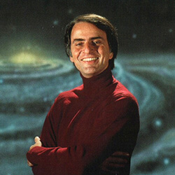

Prvi S&SF ciklus tribina biće održan u čast Karla Segana (Carl Segan, 1934-1996), astronoma i kosmologa, najpoznatijeg po popularizaciji nauke (serijal „Kosmos”, 1980), učešću u lansiranju satelita Vojadžer 1977. i osnivanju Instituta SETI 1982.
